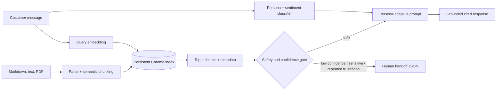

# Lumina Support AI

Lumina is a production-oriented, persona-adaptive customer support agent. It classifies each customer as a Technical Expert, Frustrated User, or Business Executive; retrieves verified support material; adapts tone and detail; and creates a structured human handoff whenever confidence, sensitivity, or customer sentiment makes automation unsafe.

The repository is complete and evaluator-friendly: it runs with Gemini for semantic embeddings and generated responses, while a deterministic local mode supports end-to-end evaluation and tests without an API key.

## Feature coverage

- Three required personas with visible confidence and reasoning
- Persistent Chroma vector database, document chunking, top-k cosine retrieval, and source/page/section metadata
- Grounded, citation-aware adaptive answers with a strict no-hallucination prompt
- Configurable confidence, sensitive-topic, repeated-frustration, and human-request escalation
- Structured JSON handoff with history, documents, attempted actions, priority, and recommendations
- Multi-turn conversation memory, loading/error/empty/success states, responsive chat UI, CLI, and handoff download
- 12 realistic knowledge articles plus a designed PDF guide
- Automated unit, integration, retrieval, and offline end-to-end tests
- Docker, environment template, deployment guide, API contract, and recording script

## Technology stack

| Layer | Choice | Why |
|---|---|---|
| Runtime | Python 3.11+ | Assessment requirement and mature AI ecosystem |
| UI | Streamlit 1.40+ | Responsive chat UX and rapid deployability |
| LLM | Google Gemini 2.5 Flash | Structured classification and low-latency grounded generation |
| Embeddings | Gemini Embedding 001 | Semantic retrieval in configured production mode |
| Local evaluation | Signed feature hashing | Deterministic, private, zero-secret test path |
| Vector store | ChromaDB | Persistent cosine index with metadata |
| Documents | PyPDF + Markdown/text | Page-aware PDF ingestion and clean authored articles |
| Tests | pytest | Focused unit and end-to-end coverage |
| Deployment | Docker / Streamlit Cloud | Reproducible local or hosted execution |

Version ranges are pinned in `requirements.txt`; exact resolved versions are determined by the target Python 3.11 environment.

## Architecture



The service layer orchestrates pure domain components. Both the web and CLI interfaces call the same `SupportService`, which makes behavior testable and keeps UI code free of model and database details.

## Project structure

```text
persona-support-agent/
├── app.py                     # Responsive Streamlit experience
├── cli.py                     # Interactive terminal fallback
├── src/
│   ├── classifier.py          # Gemini JSON + deterministic classifier
│   ├── rag_pipeline.py        # Parsing, chunking, embeddings, Chroma
│   ├── generator.py           # Grounded persona-adaptive output
│   ├── escalator.py           # Safety triggers and handoff builder
│   ├── service.py             # Application orchestration
│   ├── config.py              # Validated environment configuration
│   └── models.py              # Typed domain contracts
├── data/                      # 12 articles + generated PDF
├── tests/                     # Unit, retrieval, integration tests
├── scripts/                   # Reproducible PDF asset generator
├── .streamlit/config.toml     # Theme and server behavior
├── API.md                     # Service contract
├── DEPLOYMENT.md              # Hosted and container deployment
├── DEMO_SCRIPT.md             # Required screen-recording outline
├── Dockerfile / docker-compose.yml
└── .env.example / requirements*.txt / pyproject.toml
```

## Persona detection strategy

With `GEMINI_API_KEY`, Gemini returns strict structured JSON containing persona, confidence, reasoning, and sentiment. The classifier prompt defines mutually exclusive communication signals and runs at temperature 0. In local mode, weighted vocabulary, emotional punctuation, and intent signals provide deterministic classification. A neutral support question defaults toward an outcome-oriented executive response; problem language defaults toward the empathy-oriented persona.

The fallback is not a hardcoded answer system: it classifies dynamic text, vectorizes arbitrary documents, performs cosine retrieval, and composes answers from retrieved content.

## RAG pipeline design

Documents are parsed by format. Markdown headings become section metadata; PDFs are extracted page-by-page. Text is split into approximately 850-character chunks with 120-character overlap, preferring sentence boundaries. IDs are content-addressed SHA-256 hashes, making ingestion idempotent.

Gemini embeddings are used when configured. Local evaluation uses normalized signed feature hashing over words and bigrams. Both paths store vectors, text, source, section, and page in a persistent Chroma cosine index. The query uses the same provider and returns the top `TOP_K` chunks. The answer prompt accepts only retrieved context and requires inline numeric citations.

## Escalation logic

Escalation is evaluated before generation:

- top retrieval score below `RETRIEVAL_THRESHOLD` or no result;
- billing, refunds, legal issues, account ownership, payment, or credential-sensitive changes;
- repeated Frustrated User turns at `FRUSTRATION_TURN_THRESHOLD`;
- an explicit request for a human, supervisor, or escalation.

Multiple triggers or fraud/legal/production-down language raises priority to urgent. The handoff includes the detected persona, current issue, recent conversation, citations, customer-attempted actions parsed from the conversation, reasons, priority, and recommended next steps.

## Local setup

### 1. Create an environment

```bash
cd persona-support-agent
python -m venv .venv
```

Activate it:

```bash
# Windows PowerShell
.venv\Scripts\Activate.ps1

# macOS / Linux
source .venv/bin/activate
```

### 2. Install and configure

```bash
python -m pip install -r requirements-dev.txt
copy .env.example .env       # Windows
# cp .env.example .env       # macOS / Linux
python scripts/generate_password_pdf.py
```

Add a Gemini key to `.env` for the production model path. Leaving it blank intentionally selects local evaluation mode.

| Variable | Default | Purpose |
|---|---:|---|
| `GEMINI_API_KEY` | blank | Enables Gemini classification, embedding, and generation |
| `GEMINI_MODEL` | `gemini-2.5-flash` | Generation/classification model |
| `GEMINI_EMBEDDING_MODEL` | `gemini-embedding-001` | Embedding model |
| `TOP_K` | `4` | Retrieved chunks per query |
| `RETRIEVAL_THRESHOLD` | `0.28` | Minimum top cosine confidence |
| `FRUSTRATION_TURN_THRESHOLD` | `2` | Consecutive dissatisfied interactions before handoff |
| `MAX_HISTORY_TURNS` | `12` | Conversation turns retained |
| `ENABLE_LOCAL_FALLBACK` | `true` | Documents the intended offline fallback policy |

### 3. Run

```bash
streamlit run app.py
```

Open `http://localhost:8501`. For the CLI instead, run `python cli.py`.

## Testing and quality checks

```bash
pytest --cov=src --cov-report=term-missing
ruff check .
```

Recommended manual scenarios:

1. `What Authorization header and token checks should I run for a 401?` - Technical Expert; detailed diagnostics.
2. `I've cleared cookies twice and nothing works!` - Frustrated User; empathetic short steps.
3. `What is the operational impact and leadership update timeline?` - Business Executive; concise impact and timing.
4. `Why is our SAML login looping after IdP configuration?` - Technical Expert; SAML retrieval.
5. `I have duplicate charges and demand an immediate refund!` - sensitive-topic escalation and JSON handoff.

Also verify a second frustrated turn escalates, a nonsensical unsupported query triggers low-confidence handoff, citations expand correctly, the handoff downloads, and the layout remains usable at 375 px, 768 px, and desktop widths.

## Deployment

See [DEPLOYMENT.md](DEPLOYMENT.md) for Streamlit Cloud, Docker Compose, persistence, secrets, health checks, and the production checklist. The shortest container path is:

```bash
copy .env.example .env
docker compose up --build
```

## Security, accessibility, and performance

- Secrets are environment-only and `.env` is ignored.
- Sensitive workflows are never automated; handoffs instruct identity verification.
- Input length is bounded and errors are converted into safe messages.
- The interface uses semantic headings, native controls, keyboard-compatible expanders/buttons, strong contrast, responsive typography, and non-color status labels.
- Resources and the index are cached; ingestion is idempotent; documents are embedded in batches; only bounded history and top-k context reach the model.
- For public deployment, add authentication at the hosting layer, rate limiting, centralized audit logs, and a managed persistent vector service.

## Known limitations and next improvements

- Local feature hashing is intentionally less semantic than Gemini embeddings; configure the key for production relevance.
- Streamlit session memory is per browser session, not durable customer history.
- Confidence is vector similarity, not a calibrated probability. Production teams should calibrate it on labeled support queries.
- The assignment does not provide a real ticketing backend. The structured handoff is ready to post to Zendesk, Intercom, or a queue after credentials and authorization rules are supplied.
- PDF extraction assumes text PDFs. Add OCR for scanned documents.
- Human feedback analytics and approval queues are natural next steps.

<!-- ## Submission checklist

- [x] Three personas detected and displayed
- [x] 10-20 meaningful knowledge documents, including PDF
- [x] Chunking, embeddings, persistent vector database, top-k retrieval
- [x] Source document and section/page metadata
- [x] Grounded persona-specific generation
- [x] Configurable escalation and structured handoff
- [x] Web chat and CLI; responsive states and downloads
- [x] Tests, environment template, deployment, API, and architecture documentation
- [ ] Push to a public GitHub repository
- [ ] Deploy and add the live URL
- [ ] Record the live 3-8 minute demo using `DEMO_SCRIPT.md`

The final three unchecked deliverables require the candidate's external accounts and live participation; everything inside the repository is ready for them. -->

